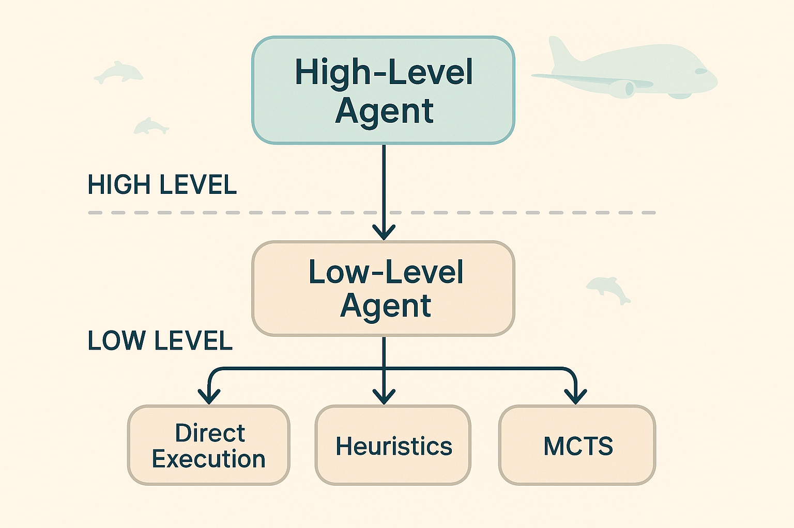

# FoPra – Beluga Challenge  
**Hierarchischer Reinforcement-Learning-Agent**

---

## 📌 Projektbeschreibung
Dieses Projekt implementiert einen **hierarchischen RL-Agenten** für die *Beluga Challenge*.  
Der Ansatz trennt strategische Entscheidungen (High-Level) von der konkreten Ausführung (Low-Level), um unterschiedliche Methoden wie **PPO**, **Heuristiken** und **MCTS** gezielt zu kombinieren.

---

## 🏗 Architekturübersicht

Unsere Architektur folgt einem **hierarchischen Entscheidungsansatz**:

- **High-Level Agent**  
  - Wählt eine von acht möglichen Aktionen  
  - Trainiert mit **Proximal Policy Optimization (PPO)**  
  - Verantwortlich für die strategische Richtung

- **Low-Level Agent**  
  - Verfeinert und führt die gewählte High-Level-Aktion aus  
  - Setzt je nach Komplexität unterschiedliche Mechanismen ein:  
    - 🔹 **Direkte Ausführung** – deterministische Aktionen ohne Parameter  
    - 🔹 **Heuristiken** – einfache parametrisierte Aktionen  
    - 🔹 **Monte Carlo Tree Search (MCTS)** – komplexe, sequenzielle Entscheidungen mit großem Kombinationsraum

### 🎯 Die 8 verfügbaren Aktionen:
1. **`load_beluga`** - Beluga mit Jigs vom Trailer beladen
2. **`unload_beluga`** - Jigs aus dem Beluga entladen  
3. **`get_from_hangar`** - Jigs aus dem Hangar holen
4. **`deliver_to_hangar`** - Jigs zum Hangar transportieren
5. **`left_stack_rack`** - Jigs auf dem linken Rack stapeln
6. **`right_stack_rack`** - Jigs auf dem rechten Rack stapeln
7. **`left_unstack_rack`** - Jigs vom linken Rack entstapeln
8. **`right_unstack_rack`** - Jigs vom rechten Rack entstapeln

> 💡 **Vorteil:** Durch diese modulare Trennung können wir die Stärken verschiedener Methoden gezielt nutzen und die Charakteristika einzelner Teilprobleme optimal abdecken.

## 📄 Projektdokumentation
Die vollständige generierte HTML-Dokumentation findest du hier:  
[📖 Projekt-Dokumentation anzeigen](https://youssef27db.github.io/FoPra-Beluga-Challenge)

