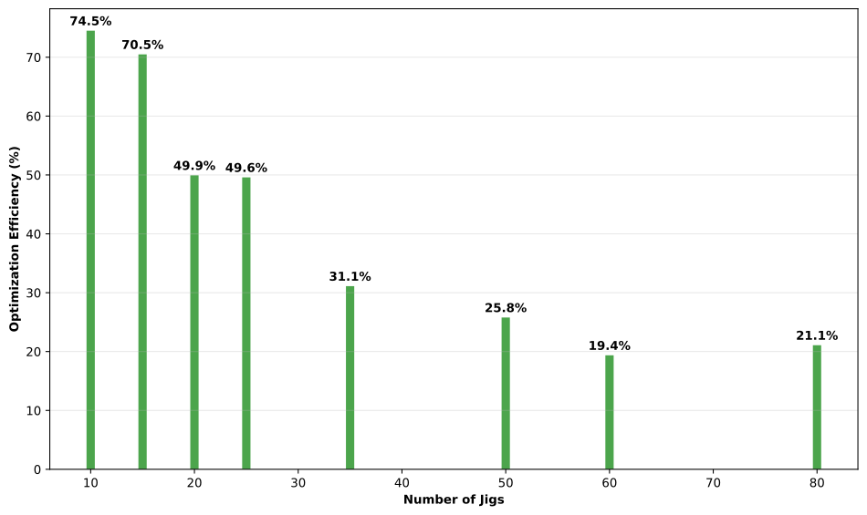
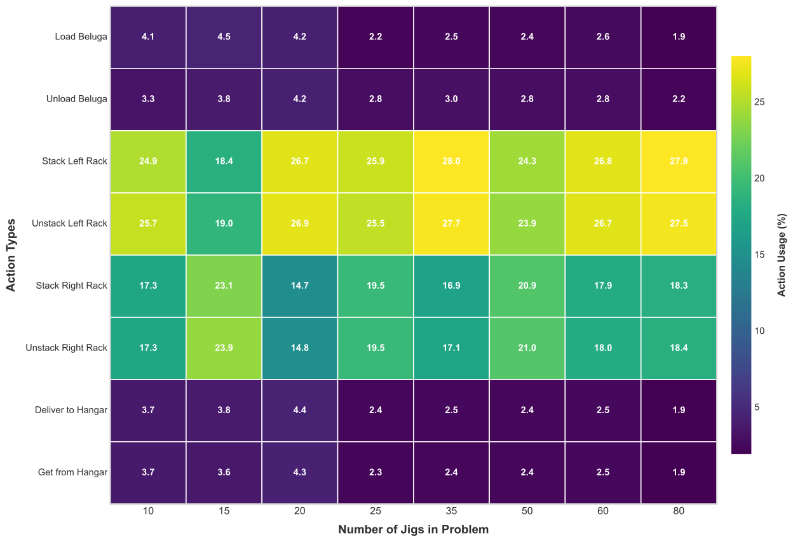
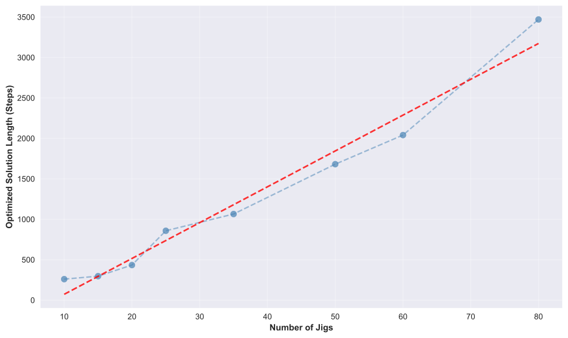

# Reinforcement Learning für Beluga Challenge

Dieses Verzeichnis enthält die Reinforcement Learning Lösung für die Beluga Challenge - ein Containerschiff-Optimierungsproblem mit PPO (Proximal Policy Optimization) Agent und MCTS.

## Überblick

Die Lösung verwendet einen hierarchischen Ansatz mit:
- **High-Level Agent**: PPO Agent für strategische Entscheidungen
- **Low-Level Heuristiken**: Für spezifische Containerplatzierung
- **MCTS**: Monte Carlo Tree Search für Exploration
- **Environment**: Simulation der Beluga Challenge Umgebung

## Verzeichnisstruktur

```
rl/
├── agents/           # Agent-Implementierungen
│   ├── high_level/   # PPO Agent
│   └── low_level/    # Heuristische Agents
├── env/              # Umgebung und Zustandsrepräsentation
├── mcts/             # Monte Carlo Tree Search
├── training/         # Training-Logic
├── utils/            # Hilfsfunktionen
└── main.py           # Haupteinstiegspunkt
```

## Verwendung

### Hilfe anzeigen
```bash
python -m rl.main --help
```

### Training

#### Basis Training
```bash
python -m rl.main --mode train
```

#### Training mit benutzerdefinierten Parametern
```bash
python -m rl.main --mode train --n_episodes 5000 --base_index 61
```

#### Training mit Permutation
```bash
python -m rl.main --mode train --n_episodes 5000 --base_index 61 --use_permutation
```
### Evaluierung

#### Modell Evaluierung
```bash
python -m rl.main --mode eval
```

#### Evaluierung mit Plot
```bash
python -m rl.main --mode eval --n_eval_episodes 20 --plot
```

#### Evaluierung mit benutzerdefinierten Parametern
```bash
python -m rl.main --mode eval --n_eval_episodes 50 --max_steps 300
```

### Problem-spezifische Evaluierung

#### Evaluierung eines spezifischen Problems
```bash
python -m rl.main --mode problem --problem_path "problems/problem_7_s49_j5_r2_oc85_f6.json"
```

#### Evaluierung mit Ergebnis-Speicherung
```bash
python -m rl.main --mode problem --problem_path "problems/problem_7_s49_j5_r2_oc85_f6.json" --save_to_file
```

#### Evaluierung eines großen Problems
```bash
python -m rl.main --mode problem --problem_path "problems/problem_90_s132_j137_r8_oc81_f43.json" --max_problem_steps 50000 --save_to_file
```

## Parameter Übersicht

### Allgemeine Parameter
- `--mode`: Modus (`train`, `eval`, `problem`)
- `--base_index`: Basis Index für Problemauswahl (Standard: 61)

### Training Parameter
- `--train_old_models`: Bestehende Modelle laden (Standard: True)
- `--use_permutation`: Observation Permutation verwenden (Standard: False)
- `--n_episodes`: Anzahl Trainingsepisoden (Standard: 10000)

### Evaluierungs Parameter
- `--n_eval_episodes`: Anzahl Evaluierungsepisoden (Standard: 10)
- `--max_steps`: Maximale Schritte pro Episode (Standard: 200)
- `--plot`: Plot nach Evaluierung anzeigen (Standard: False)

### Problem Evaluierungs Parameter
- `--problem_path`: Pfad zum Problem (Standard: "problems/problem_90_s132_j137_r8_oc81_f43.json")
- `--max_problem_steps`: Maximale Schritte für Problemevaluierung (Standard: 20000)
- `--save_to_file`: Ergebnisse in TXT-Datei speichern (Standard: False)


## Modell-Konfiguration

Der PPO Agent wird mit folgenden Standardparametern konfiguriert:
- **Aktionen**: 8 mögliche Aktionen
- **Batch Size**: 128
- **Epochen**: 5
- **Lernrate**: 0.0005
- **Buffer Size**: 1024
- **Policy Clip**: 0.2

## Ausgabedateien

Bei Verwendung von `--save_to_file` werden die Ergebnisse in TXT-Dateien im "results" Verzeichnis gespeichert.

## Auswertung von Problemen

| Größe (in Jigs) | Zeit | Steps | Steps optimiert | Optimierung |
|---|---|---|---|---|
| 10 | 1,63 s | 778 | 286 | 63 % |
| 20 | 4,33 s | 1289 | 541 | 58 % |
| 43 | 8,96 s | 1204 | 862 | 28 % |
| 61 | 15,78 s | 1072 | 900 | 16 % |
| 78 | 1m 13s | 2958 | 2374 | 19 % |
| 103 | 2m 56s | 7465 | 6455 | 13,5 % |
| 132 | 5m 14s | 10561 | 8761 | 17 % |
| 177 | 17m 34s | 29804 | 24170 | 18,9 % |

## Analyse von Problemen

**Bild 1**: Die Grafik zeigt die Optimierungseffizienz (in %) in Abhängigkeit von der Anzahl der Jigstep-Probleme. Bei wenigen Jigs (10–15) liegt die Effizienz noch sehr hoch bei über 70 %, sinkt jedoch deutlich mit steigender Problemgröße und fällt bei 80 Jigs auf etwa 21 %.




**Bild 2**: Illustriert den 8-dimensionalen Aktionsraum des Agenten und die Zustandsrepräsentation der Beluga Challenge Umgebung. Zeigt die verschiedenen Aktionen wie Beladen/Entladen, Hangar-Operationen und Rack-Manipulationen.




**Bild 3**: Diese Grafik stellt die optimierte Lösungs­länge (in Schritten) für verschiedene Jigstep-Problemgrößen dar. Mit zunehmender Anzahl von Jigs steigt die benötigte Schrittzahl nahezu linear an, wobei die blaue Kurve die gemessenen Werte und die rote Linie den linearen Trend darstellt.

