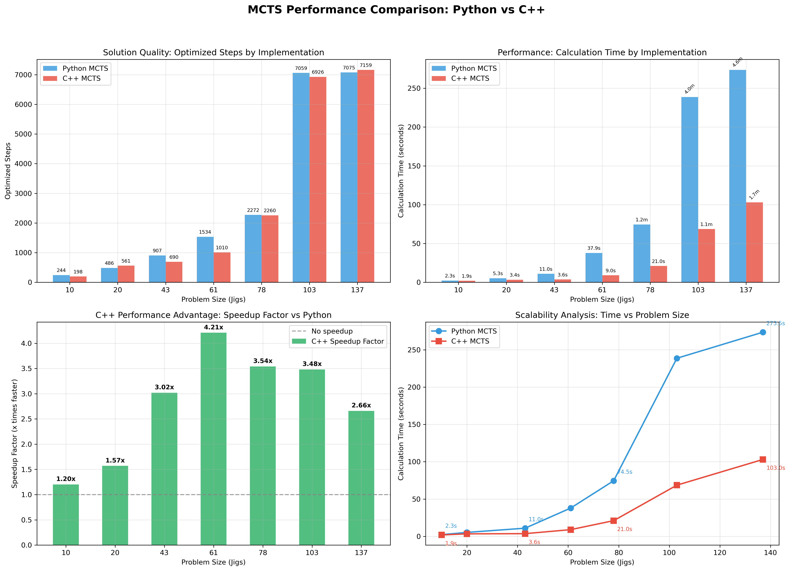

# MCTS Implementation for Beluga Challenge

This module provides both Python and C++ implementations of Monte Carlo Tree Search (MCTS) for the Beluga Challenge container optimization problem.

## Features

- **High-Performance C++ Implementation**: Significantly faster than Python for intensive MCTS searches
- **Automatic Fallback**: Seamlessly falls back to Python implementation if C++ is unavailable
- **Drop-in Replacement**: No code changes required in existing trainer or evaluation scripts
- **Compatible API**: Maintains the same interface as the original Python implementation

## Installation

### Building the C++ Extension

```bash
cd rl/mcts/mcts_fast
python setup.py build_ext --inplace
```

Requirements:
- Python 3.7+
- pybind11 (`pip install pybind11`)
- C++17 compatible compiler

## Usage

### Automatic Selection (Recommended)

The system automatically uses the C++ implementation if available:

```python
from rl.mcts import MCTS, MCTSNode

# Will use C++ implementation if available, Python otherwise
root = MCTSNode(state=problem_state, action=("left_stack_rack", None))
mcts = MCTS(root, depth=5, n_simulations=300)
best_node = mcts.search()
```

### Force Python Implementation

To explicitly use the Python implementation:

```bash
export USE_CPP_MCTS=false
python -m rl.main --mode train
```

Or in Python:

```python
import os
os.environ['USE_CPP_MCTS'] = 'false'

from rl.mcts import MCTS, MCTSNode
# Will use Python implementation
```

### Check Implementation Status

```python
from rl.mcts import get_mcts_implementation_info

info = get_mcts_implementation_info()
print(f"Using: {info['default_implementation']}")
print(f"C++ available: {info['cpp_available']}")
```

## Performance

The C++ implementation provides significant speedup:

- **2-10x faster** for typical MCTS searches
- **Lower memory usage** for large state spaces
- **Better scaling** with increased simulation counts

### Benchmark Visualization

Visual analysis of the performance data is available through the benchmark plotting script:

```bash
cd rl/mcts
python benchmark_plots.py
```

This generates comprehensive charts showing:

- **Solution Quality**: Optimized steps comparison between implementations
- **Performance**: Calculation time comparison across problem sizes
- **Speedup Analysis**: C++ performance advantage factors
- **Scalability**: Linear-scale analysis of time complexity trends



### Benchmark Results

Comprehensive performance comparison between Python and C++ MCTS implementations:

| Problem | Jigs | Implementation | Zeit | Schritte | Opt. Schritte | Optimierung | Speedup |
|---------|------|----------------|------|----------|---------------|-------------|---------|
| problem_166 | 10 | **Python** | 2.31s | 822 | 244 | 70.32% | - |
| problem_166 | 10 | **C++** | **1.92s** | 1066 | 198 | 81.43% | **1.20x** |
| problem_49 | 20 | **Python** | 5.29s | 1190 | 486 | 59.16% | - |
| problem_49 | 20 | **C++** | **3.37s** | 1417 | 561 | 60.41% | **1.57x** |
| problem_74 | 43 | **Python** | 10.96s | 1187 | 907 | 23.59% | - |
| problem_74 | 43 | **C++** | **3.63s** | 980 | 690 | 29.59% | **3.02x** |
| problem_92 | 61 | **Python** | 37.88s | 1820 | 1534 | 15.71% | - |
| problem_92 | 61 | **C++** | **9.00s** | 1255 | 1010 | 19.52% | **4.21x** |
| problem_45 | 78 | **Python** | 74.5s | 2740 | 2272 | 17.08% | - |
| problem_45 | 78 | **C++** | **21.04s** | 2824 | 2260 | 19.97% | **3.54x** |
| problem_82 | 103 | **Python** | 238.6s | 8317 | 7059 | 15.13% | - |
| problem_82 | 103 | **C++** | **68.6s** | 9232 | 6926 | 24.98% | **3.48x** |
| problem_90 | 137 | **Python** | 273.5s | 8483 | 7075 | 16.60% | - |
| problem_90 | 137 | **C++** | **103.0s** | 11044 | 7159 | 35.18% | **2.66x** |

#### Key Performance Insights:

- **Small problems (10-20 Jigs):** 1.2-1.6x speedup with C++
- **Medium problems (43-61 Jigs):** 3.0-4.2x speedup with C++  
- **Large problems (78-137 Jigs):** 2.7-3.5x speedup with C++
- **Scalability:** C++ maintains consistent performance advantage across all problem sizes
- **Solution Quality:** Both implementations achieve comparable optimization results
- **Largest Problem:** For 137 Jigs, C++ saves over 2.5 minutes compared to Python

## Integration with Trainer

No changes required to existing code. The trainer automatically uses the faster implementation:

```python
# In trainer.py - this automatically uses C++ MCTS if available
root = MCTSNode(state=self.env.state, action=(high_level_action_str, None))
mcts = MCTS(root, depth=5, n_simulations=60)
best_node = mcts.search()
```

## Troubleshooting

### C++ Compilation Issues

1. **Missing pybind11**: Install with `pip install pybind11`
2. **Compiler errors**: Ensure you have a C++17 compatible compiler
3. **macOS**: May need Xcode command line tools: `xcode-select --install`

### Runtime Issues

If you encounter issues with the C++ implementation:

1. **Force Python fallback**: Set `USE_CPP_MCTS=false`
2. **Check compilation**: Run `python test_cpp_mcts.py` in the `mcts_fast` directory
3. **Debug mode**: Enable debug output with `debug=True` in MCTS constructor

### Verification

Run the integration test to verify everything works:

```bash
python test_integration.py
```

This tests:
- C++ implementation functionality
- Automatic fallback to Python
- Trainer compatibility
- Real problem state handling

## API Reference

### MCTS Class

```python
class MCTS:
    def __init__(self, root, depth=5, n_simulations=300, debug=False):
        """
        Initialize MCTS search.
        
        Args:
            root: MCTSNode root of the search tree
            depth: Maximum search depth
            n_simulations: Number of simulations to run
            debug: Enable debug output
        """
    
    def search(self):
        """
        Run MCTS search algorithm.
        
        Returns:
            MCTSNode: Best child node found, or None if no solution
        """
```

### MCTSNode Class

```python
class MCTSNode:
    def __init__(self, state, parent=None, action=None, depth=0):
        """
        Initialize MCTS node.
        
        Args:
            state: ProblemState for this node
            parent: Parent MCTSNode (None for root)
            action: Action taken to reach this state
            depth: Depth in the search tree
        """
```

## Contributing

When modifying the MCTS implementation:

1. **Update both implementations**: Ensure Python and C++ versions stay in sync
2. **Test thoroughly**: Run both `test_cpp_mcts.py` and `test_integration.py`
3. **Maintain API compatibility**: Don't break existing trainer code
4. **Document changes**: Update this README with any new features

## License

Same license as the main Beluga Challenge project.